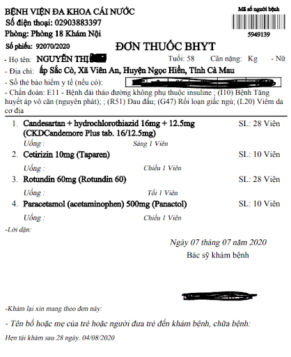

# Export GeoLayoutLM: Geometric Pre-training for Visual Information Extraction to ONNX.

This repo was built to do NER and RE task with Vietnamese dataset (we replace Bert-Tokenizer to PhoTokenizer). But it also can apply with original model.

## Preparation
1. Install this repo.
```bash
git clone https://github.com/HungVu307/vie_geo_llm
```
2. Install requirement packages.
```bash
pip install requirements.txt
```
## Export to ONNX
Make sure that the model was trained, you can follow the [Original Repo](https://github.com/AlibabaResearch/AdvancedLiterateMachinery/tree/main/DocumentUnderstanding/GeoLayoutLM). (Save the check point in `checkpoints`)

To export model to ONNX:
```bash
python onnx_geollm.py
```
Custome your inference session in `infer_ONNX_model.py`. 
```bash
python --path_image 'YOUR_PATH_IMG' --onnx_model_path 'ONNX_MODEL.onnx'
```

## Example Result


With NER task, the result was shown in `output_hanam_ONNX.txt`.

Please give us :star: if it was useful to your work.